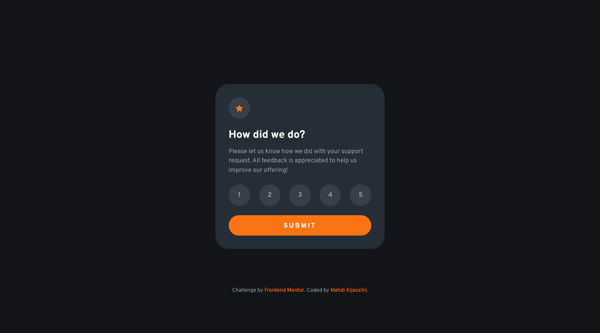

# Frontend Mentor - Interactive rating component solution

This is a solution to the [Interactive rating component challenge on Frontend Mentor](https://www.frontendmentor.io/challenges/interactive-rating-component-koxpeBUmI).  
Frontend Mentor challenges help you improve your coding skills by building realistic projects. 

\*Me\* : I agree 👍

## Table of contents

- [Overview](#overview)
  - [The challenge](#the-challenge)
  - [Screenshot](#screenshot)
  - [Links](#links)
- [My process](#my-process)
  - [What I learned](#what-i-learned)
  - [Notice](#notice)
- [Tools](#tools)
- [Author](#author)

## Overview

### The challenge

Users should be able to:

- View the optimal layout for the app depending on their device's screen size
- See hover states for all interactive elements on the page
- Select and submit a number rating
- See the "Thank you" card state after submitting a rating

### Screenshot



### Links

- Solution URL: <https://your-solution-url.com>
- Live Site URL: <https://your-live-site-url.com>

## My process

### What I learned

I have begun using ARIA attributes on my elements. Such as:

```html
<div class="card" id="rating-component" aria-live="assertive">
```

An "`aria-live`" attribute indicates that an element's contents expect change in near future. And since elements with "`display: none`" are not announced by assistive technology, when the class attribute on `#rating-component` alters the entire div would be announced again but with new content.

### Notice

I decided to breach the design instructions regarding active states of radio buttons. The design suggests that a checked radio button would acquire a light gray background, whereas a hovered-over one would get an orange background. This is in my opinion pretty misleading.

Normally, people associate a change of color with a change of state, and a big change of color with a samely big change of state. If a radio button was gray then turned orange, a user might suggest it has got checked! Especially if it's a technically illiterate person.

I consider the state of being checked is more important and should be more clearly annunciated than just being hovered over. So, I flipped colors. A checked radio is orange, and a hovered-over one is light gray.

## Tools

- [Dev Docs](https://devdocs.io) - The resource I was constantly referring to throughout the process. It's an offline web app that has a huge collection of documentations.
- [Brackets](https://brackets.io) - My text editor. Not as powerful as VSCode, but still my favorite.
- Chrome - This web page was only tested on Chrome. 

## Author

- GitHub - [Mahdi Aljaza'iri](https://github.com/MahdiAljazairi)
- Frontend Mentor - [@MahdiAljazairi](https://www.frontendmentor.io/profile/MahdiAljazairi)
